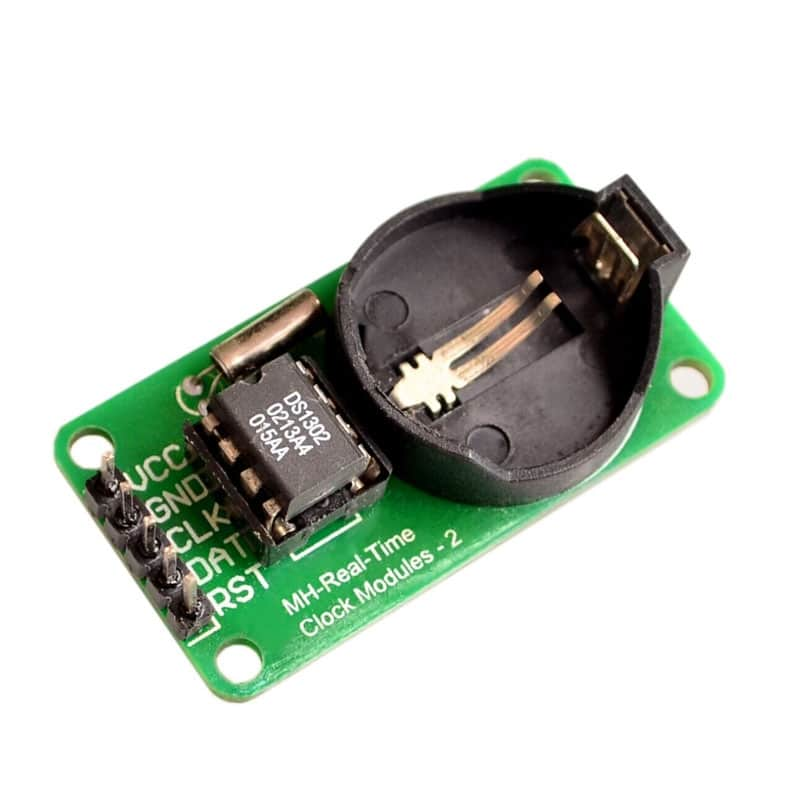

# ⏰ STM32 Driver for DS1302 Real-Time Clock



This repository provides a C library to interface with the DS1302 Real-Time Clock (RTC) module using STM32 microcontrollers. The driver enables easy interaction with the DS1302 chip through SPI in half duplex mode, allowing date and time management.

## 🚀 Features

- Supports full read/write access to time, date, and calendar registers.
- 24-hour and 12-hour mode support.
- Read and write protection support.
- Battery backup handling.
- STM32 HAL compatible.
- Designed for use with STM32CubeMX and STM32CubeIDE.
- No need for hardware SPI: uses software-based protocol.

## 📁 Project Structure

├── Inc/ │ └── ds1302.h ├── Src/ │ └── ds1302.c ├── docs/ │ └── DS1302_module.jpg ├── README.md └── LICENSE

## 🛠️ Requirements

- STM32CubeMX and STM32CubeIDE.
- STM32 HAL library configured for GPIO.
- DS1302 RTC module connected to SPI and GPIO pins (CE, IO, SCLK).

## ⚙️ Setup

1. Connect the DS1302 module to your STM32 pins, this example was made by using the STM32F103C8t6 (blue pill).

    | DS1302 PIN   | STM32 PIN  | Function    |
    |:------------:|:----------:|:-----------:|
    | CE/NRST      | PA4        | GPIO_OUTPUT |
    | SCLK         | PA5        | SPI_CLK     |
    | IO           | PA7        | SPI_MOSI    |

> ⚠️ **Warning:** Ensure proper voltage levels (typically 5V for DS1302). Use level shifters if your MCU runs at 3.3V to avoid damage.

2. Configure your MCU using `STM32CubeMx`, or `STM32CUbeIDE` to run:
    - One channel of SPI in HALF duplex mode.
    - One USART channel to print using a serial console the information reported by the DS1302 peripheral.
    - One timer that should be triggered each 0.5 seconds, the timer interrupt shall have the higest priority.
    
    > ℹ️ **Note:** Inside the [`doc/latexDocument`](doc/latexDocument) directory, you will find helpful resources and documentation regarding STM32 microcontroller configuration. In the [`Test_SPI_HalfDuplex`](Test_SPI_HalfDuplex) folder, you will find a configured example that demonstrates the practical use of this library, along with all the resources needed to build the example presented in the following sections.
3. Include the `ds1302.c` and `ds1302.h` files in your STM32 project.
4. Initialize the RTC and configure the time/date as needed in `main.c`.
5. Try to inlude this example in your own `main.c` file to test it.

>💡**Tip:** The DS1302 can retain time data even when the main power is off, provided a backup battery is connected. Ensure the battery is installed and the Vbat pin is properly wired.

>ℹ️ **Info:** This driver implements the way to drive the DS1302 RTC by using hardware SPI peripherals, it does not consider the bit banging method.

## 💡 Example Usage
In this example, I reference the `sdbg.h` file, which I use as an interface to extract information via UART. However, it is not strictly necessary, since the following function could also be used to display the data received from the RTC:
```c
HAL_UART_Transmit(&huart2, data, 12, 1000);
```
This example uses a Timer 3 interrupt that triggers every 0.5 seconds to refresh the time. Since this example involves operations using demanding peripherals like UART inside an interrupt (which is not recommended), the Timer 3 interrupt must have the highest priority over all others, as mentioned in the "setup" section, to ensure proper functionality of the example.

```c
#include "../ds1302/ds1302.h"
#include "../sdbg/sdbg.h"

#define HOUR_FORMAT	(0) // 0 = 0-24h; 1= 0-12h
#define HOUR 		(17U)
#define MINUTES 	(25U)
#define SECONDS 	(00U)
#define AM_PM		(1U)
#define WEEKDAY 	(1U)
#define MONTHDAY 	(26U)
#define MONTH 		(9U)
#define YEAR 		(2021U)

//generated with stm32cubeMX
SPI_HandleTypeDef hspi1;
TIM_HandleTypeDef htim3;
UART_HandleTypeDef huart1;

static uint32_t encoderPos = 0;
static uint8_t flag_spi=0;
static ds1302_T rtc;

static ds1302_cfg_T ds1302_config = {
	&hspi1,
	{GPIOA, GPIO_PIN_4}
};

void HAL_TIM_PeriodElapsedCallback(TIM_HandleTypeDef *htim)
{
	//check if the interrupt comes from TIM3
	if (htim->Instance == TIM3){
		HAL_GPIO_TogglePin(GPIOC, GPIO_PIN_13);
		encoderPos=(encoderPos+1)%60;
		SDBG_print(&huart1,"%d : %d : %d",rtc.data.dateandtime.hours, rtc.data.dateandtime.minutes, rtc.data.dateandtime.seconds);
		flag_spi = 1u;
	}
}

int main(void)
{
	DS1302_Init(&rtc, &ds1302_config);
	DS1302_setTime(&rtc, HOUR_FORMAT, HOUR, MINUTES, SECONDS, AM_PM, WEEKDAY, MONTHDAY, MONTH, YEAR);
	while (1)
	{
		if(flag_spi){
			DS1302_updateDateTime(&rtc);
			flag_spi=0;
		}
	}
}
```
## 📚 References
This library was inspired by and based on the following resources:

[Real Time Clock Concepts] (https://en.wikipedia.org/wiki/Real-time_clock)

## 🔖 Tags
STM32 DS1302 RTC Time Clock HAL C Microcontroller Embedded STM32CubeMX STM32CubeIDE RealTime STM32Drivers

## 📄 License
This project is licensed under the GPL V3 License.

## 🤝 Contributing
Contributions are welcome! Feel free to open issues or submit pull requests to improve this library.
